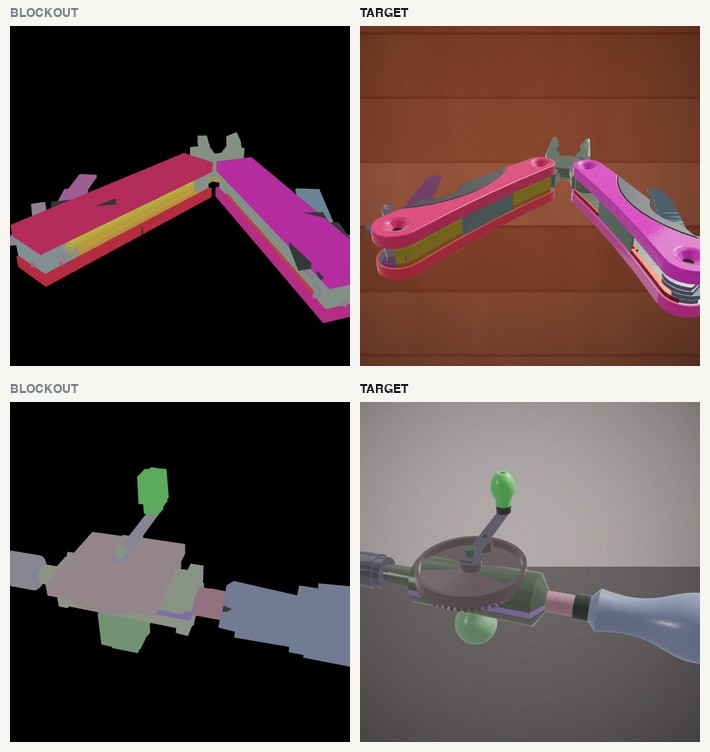

# Reconstruction dataset

Paired **blockout → photograph** data for training a renderer that turns a
crude 3D sketch of an assembly step into a believable image of the real
object.

Each example is a rough approximation of a mechanical assembly and the
photographic render of the same assembly, from the same camera, at the same
stage of the build. The pairing is exact by construction: both come from one
CAD scene.

<p align="center">
  
</p>

## What is in this repository

**The scenes, not the renders.** Every image in the dataset is generated from
a scene, so shipping ~100 scenes (about 70 MB) replaces shipping several
hundred thousand PNGs (about 12 GB). Nothing is lost: the renderer is here
too, so the full image set can be regenerated at any resolution.

```
scenes/          one gzipped JSON per object, plus index.json
demo/            blockout on the left, target on the right, play through the build
src/             the renderer, the dataset builder, and a minimal scene reader
docs/            format notes and figures
serve.py         starts a local server and opens the demo
```

## Quick start

```bash
git clone https://github.com/maksymbuleshnyi/reconstruction-dataset.git
cd reconstruction-dataset
python3 serve.py            # opens the demo in your browser
```

That is the whole setup. No dependencies, no build step: the demo is plain
HTML and reads the scene files directly. A web server is needed only because
browsers refuse to fetch local files from a page opened off disk.

To read a scene from Python instead:

```bash
python3 src/read_scene.py scenes/20141_b9376856.json.gz
```

```
object      20141_b9376856
parts       16
steps       16
triangles   68412
radius      9.214

assembly order (first ten):
   1. ShellBottom                    non-metal  rough 0.55  rgb(235, 235, 232)
   2. M3 Screw                       metal      rough 0.42  rgb(150, 155, 162)
   ...

blockout levels, triangles per level:
  boxes          1152
  primitives    18630
  parts         68412
```

Only the standard library is needed to read the data. `numpy` and `trimesh`
are required only if you want to re-render images with `src/`.

## The demo

`serve.py` opens it for you. Pick an object, press Play, and the parts arrive in assembly order. The left
pane shows the blockout the agent would author; the right shows the real CAD
the renderer has to produce. Drag either pane to orbit, scrub to any step, and
switch the blockout between coarse boxes and mid-level primitives.

## Scene format

One file per object, `scenes/<id>.json.gz`, gzipped JSON:

| field | meaning |
| --- | --- |
| `parts[]` | the exact CAD geometry, one entry per component |
| `parts[].v` | vertex positions, flat `[x, y, z, x, y, z, ...]` |
| `parts[].f` | triangle indices, flat |
| `parts[].name` | the component name from the CAD file |
| `parts[].colour` | RGB 0-255, from the material name |
| `parts[].pbr` | `[metalness, roughness, clearcoat]`, parsed from the material name |
| `primitives[]` | convex-decomposition approximation of each part, the mid blockout |
| `boxes[]` | one oriented box per part, the coarsest blockout |
| `order[]` | assembly sequence: indices into `parts`, in the order they are placed |
| `centre`, `radius` | bounding sphere, for framing a camera |

`index.json` lists every object with its part count, step count and triangle
count.

### Three levels of geometry

The same object is present at three fidelities, which is what makes the
"how crude can the sketch be" question measurable:

| | what it is |
| --- | --- |
| `boxes` | one oriented bounding box per part |
| `primitives` | a small convex decomposition per part |
| `parts` | the real CAD triangles |

### Materials

`pbr` is parsed from the material name recorded in the CAD file, so
`Steel - Satin`, `Brass - Polished` and `Plastic - Matte (Black)` become
different numbers rather than a single metal/not-metal flag. Across the corpus
this yields roughly eight distinct material settings, from six substance
families and three finish levels.

## Regenerating the images

`src/` contains the renderer used to produce the training data: a headless
three.js pass that writes, per frame and per geometry level, a depth map, a
shading map, view-space normals, a per-part colour map, a material map, a
mask, and the photographic target.

```bash
pip install numpy trimesh pillow          # only needed for rendering
cd src
python capture_server.py 8877 &           # receives frames and writes them
python make_capture.py --one <object-id>  # render one object
python compose_dataset.py                 # composite targets, build the index
```

Rendering one object takes about fifteen seconds and produces roughly three
thousand images: every camera position, every assembly state, at all three
geometry levels. The full corpus is about 12 GB, which is why this repository
ships the scenes instead.

`CAPTURE_DIR` and `DATASET_DIR` redirect the output, so a subset can be built
somewhere separate without touching an existing set.

See `docs/FORMAT.md` for the conditioning channels and how they are laid out.

## Source data and licence

The scenes derive from the **Fusion 360 Gallery assembly dataset** published by
Autodesk AI Lab. Geometry, component names and material assignments originate
there; the blockout approximations, assembly ordering, material parsing and
rendering are ours. Check the upstream licence before redistributing:
<https://github.com/AutodeskAILab/Fusion360GalleryDataset>

## Status

The data is complete and stable. Current work is on the model: which of these
inputs a diffusion renderer can actually use, and how to route the ones it
ignores. Notes in `docs/`.
